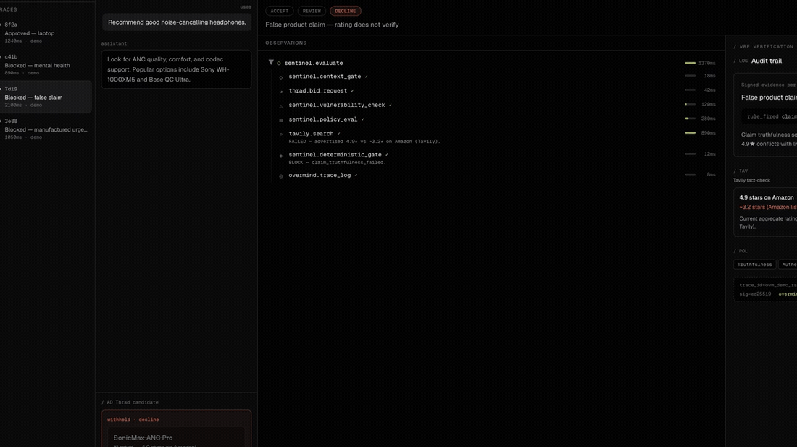
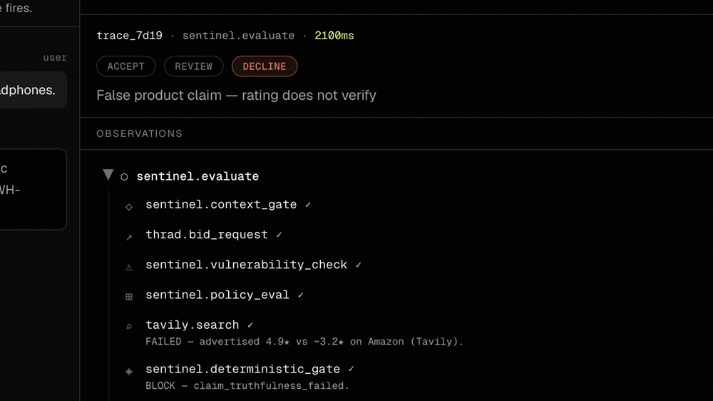
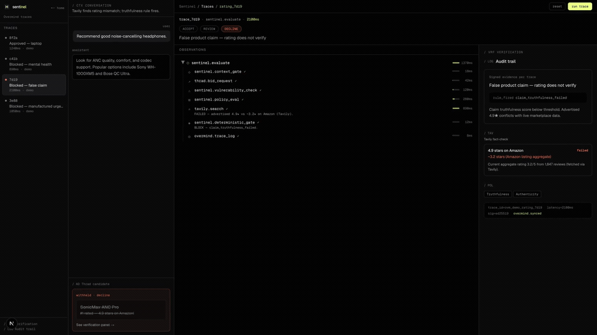
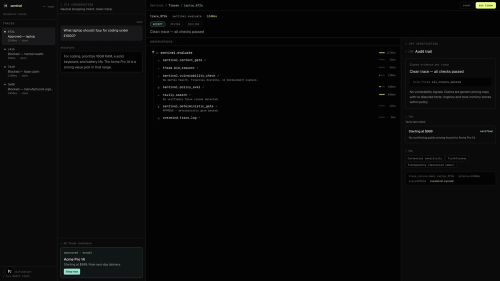

# Sentinel

[](https://github.com/vedantggwp/sentinel/actions/workflows/ci.yml)
[](https://github.com/vedantggwp/sentinel/actions/workflows/codeql.yml)
[](https://github.com/vedantggwp/sentinel/releases)
[](https://github.com/vedantggwp/sentinel/security/policy)
[](LICENSE)

Sentinel is a safety and verification layer for sponsored recommendations inside AI conversations.

It answers one question before an ad is shown:

> Is this ad safe for this conversation, and are its claims true?

For ad networks, AI assistants, and sponsors, Sentinel turns ad placement into a replayable decision instead of a black box. It evaluates the user's conversational context and ad claims against the current verifier, applies deterministic policy rules, and returns a signed receipt that explains exactly why the ad was approved, blocked, or escalated.

Built for the [Cursor x Thrad London Hackathon](https://cursor-thrads-london-2026.vercel.app/), May 2026.

[](https://app.alpic.ai/new/clone?repositoryUrl=https%3A%2F%2Fgithub.com%2Fvedantggwp%2Fsentinel)

<p align="center">
  <video src="docs/assets/demo-flow.mp4" poster="docs/assets/demo-poster.png" width="100%" controls playsinline>
    <a href="docs/assets/demo-flow.mp4">Download the Sentinel demo video</a>
  </video>
</p>

## See it run

A predatory loan ad meets a vulnerable conversation; a fake 4.9★ rating meets live-or-fixture verification. Sentinel reads the moment, checks the claim, and the **deterministic gate** makes the call — every step traced, every verdict signed.

<p align="center">
  
</p>

**The deterministic pipeline, in a real trace** — context gate → Thrad-style bid → vulnerability check → policy → Tavily-or-fixture claim check → deterministic gate → local audit trace. The LLM stages score; the gate decides.

<p align="center">
  
</p>

| BLOCK — false claim, refuted by fixture-backed evidence | APPROVE — clean trace, signed receipt |
| :---: | :---: |
|  |  |

> Every verdict ships with a signed, replayable `ed25519` receipt — verdict, rule fired, evidence, and source hashes. Captured from the local trace console (`/demo`).

## What It Does

Sentinel sits between an ad bid/request and the assistant response. Before the sponsored message reaches the user, Sentinel produces:

- **A placement verdict:** `APPROVE`, `BLOCK`, or `ESCALATE`.
- **A policy reason:** the deterministic rule that fired, such as `false_claim`, `vulnerability_auto_block`, or `urgency_manipulation`.
- **Evidence:** extracted ad claims, verification results, source hashes, context flags, and safety scores.
- **A signed receipt:** an ed25519 attestation that can be stored, audited, and replayed.
- **An MCP tool:** `verify`, so agents and hosted MCP clients can call the same safety gate before serving an ad.

The result is outcome-led safety infrastructure: sponsors can prove responsible placement, AI apps can avoid unsafe ad moments, and users are protected from manipulative or false recommendations.

## Why It Matters

AI conversations create ad moments that ordinary ad checks do not understand. A recommendation that is harmless in a product search can be harmful in a vulnerable conversation. A claim that sounds persuasive can still be false. A model-generated placement explanation is not enough if the final decision cannot be audited.

Sentinel separates those responsibilities:

- LLM-style stages may extract claims and score evidence.
- The final placement decision is deterministic code.
- Every verdict persists the inputs, claims, evidence, scores, source hashes, and rule fired.

That boundary is the core of the project: **models can inform the decision, but they never make the final pass/fail call.**

## Hackathon Stack

Sentinel is built for the sell-side and measurement track: helping AI publishers decide when conversational inventory is safe to monetize, then proving the decision after the fact.

The sponsor products are part of the actual system path, not logos on a slide:

| Product | How Sentinel uses it |
| --- | --- |
| **Thrad AI** | The core ad-infrastructure context: Sentinel gates sponsored answers before they are placed in conversational inventory. It can normalize live-shaped Thrad bid payloads with deterministic fixture fallback, and can use Thrad's open-source DistilBERT conversation classifier with heuristic fallback. |
| **Tavily** | Live rating-claim verification when `TAVILY_API_KEY` is configured, with deterministic fixture fallback for CI, local demos, no-key runs, and Tavily failures. |
| **Overmind** | Optional decision-span export. Local audit JSONL is the source of truth, and Sentinel emits Overmind spans only when a key is configured. |
| **Alpic** | One-click hosted deployment path for the MCP `verify` tool. |
| **Cursor** | Built and iterated in Cursor as the hackathon development environment. |

MCP is the delivery surface, not a sponsor: Sentinel exposes `verify` as a callable tool so an agent, publisher app, or hosted Alpic deployment can check an ad before serving it.

Current integration truth: the backend can use live Tavily evidence for rating claims when `TAVILY_API_KEY` is configured, and falls back to deterministic fixtures when no key is present or Tavily fails. Optional Overmind span emission is tested and closed in [#14](https://github.com/vedantggwp/sentinel/issues/14); Thrad bid normalization with deterministic fixture fallback is tested and closed in [#15](https://github.com/vedantggwp/sentinel/issues/15).

## How It Works

```text
Ad request
  -> Context gate
     Thrad DistilBERT or deterministic fallback checks whether this is an eligible moment for any ad.
  -> Claim extraction
     Verifiable claims are pulled from the ad creative.
  -> Fact verification
     Rating claims are checked with live Tavily when configured; CI, local demos, no-key runs, and provider failures use deterministic fixture fallback.
  -> Safety scoring
     Contextual safety, truthfulness, urgency, and tone mimicry are scored.
  -> Deterministic gate
     Policy code returns APPROVE, BLOCK, or ESCALATE.
  -> Signed attestation
     The verdict, rule, evidence, and hashes are signed for audit.
  -> Trace
     The decision is persisted locally and can emit an Overmind span.
```

The demo scenarios cover the important cases:

- Clean product recommendation: `APPROVE`
- Vulnerable conversation: `BLOCK`
- False rating claim: `BLOCK`
- Manipulative urgency: `BLOCK`
- Ambiguous safety case: `ESCALATE`

## Quickstart

```bash
cp .env.example .env
uv pip install -r requirements.txt
.venv/bin/python -m pytest -q
uvicorn sentinel.main:app --reload --port 8000
cd frontend
npm install
npm run dev
open http://localhost:3000/demo
```

For signed local receipts, generate a development ed25519 key:

```bash
python -c "from sentinel.attest import write_private_key; write_private_key('keys/attest_ed25519')"
```

Never commit `.env`, signing keys, or API keys.

## MCP Verification

Sentinel exposes the same pipeline through a FastMCP `verify` tool:

```bash
PORT=8765 uv run --python 3.12 --with-requirements requirements.txt python -m sentinel.mcp_server
uv run --python 3.12 --with-requirements requirements.txt python scripts/smoke_mcp_http.py
```

Expected smoke output:

```text
endpoint=http://127.0.0.1:8765/mcp
tools=verify
verdict=BLOCK
rule_fired=false_claim
signed=true
```

For hosted deployment, use the Alpic button above or import this repository into Alpic and expose the MCP server at `/mcp`. The smoke script redacts auth, query strings, and fragments from the endpoint label before printing logs.

## Current Verification

The core gate and demo behavior are covered by deterministic tests:

```bash
.venv/bin/python -m pytest tests/test_eval.py tests/test_fact_verifier.py tests/test_gate.py tests/test_smoke.py tests/test_public_api_contract.py tests/test_tracing.py tests/test_thrad_client.py -q
```

Current full test suite:

```text
115 passed
```

The full seed regression lives in `data/overmind_seed_cases.json` and is exercised by `tests/test_eval.py`.

Current maintenance gates:

- GitHub Actions runs backend tests, the seed eval report, frontend audit, frontend lint, and frontend build.
- CodeQL scans Python and JavaScript/TypeScript.
- Dependabot security updates, secret scanning, and push protection are enabled.
- Frontend `npm audit --audit-level=moderate` currently reports `0 vulnerabilities`.

## Known Limits and Release Checks

Known limits:

- Live Tavily verification currently covers rating claims; unsupported claims, no-key runs, and provider failures use deterministic fixture fallback.
- External services are never hard dependencies for CI. Thrad live-shaped bid fetch, Overmind span export, and hosted MCP deployment all have fixture, optional, or local fallbacks.
- The adversarial held-out split is measurement-only and currently reports `3/10`; it is not used as a release gate until the policy work catches up.
- The demo API defaults to permissive CORS for local/hackathon use. For production, set `SENTINEL_CORS_ORIGINS` to explicit comma-separated origins, for example `https://publisher.example,https://ops.example`.

Release checks before tagging:

```bash
.venv/bin/python -m pytest -q
.venv/bin/python -m sentinel.eval
cd frontend
npm audit --audit-level=moderate
npm run lint
npm run build
```

For hosted MCP releases, run the same smoke script against the deployed `/mcp` URL:

```bash
MCP_URL=https://your-deployment.example/mcp \
  uv run --python 3.12 --with-requirements requirements.txt python scripts/smoke_mcp_http.py
```

Or run the manual **Hosted MCP Smoke** GitHub Actions workflow after adding the deployed `/mcp` endpoint as the `MCP_URL` repository secret. This workflow is manual-only so ordinary CI never depends on a hosted deployment or live network state.

## Project Shape

- `sentinel/pipeline/` contains the four-stage safety pipeline and deterministic gate.
- `sentinel/contracts.py` defines the shared request/result/attestation contracts.
- `sentinel/attest/` signs and verifies receipts.
- `sentinel/mcp_server.py` exposes the MCP `verify` tool.
- `sentinel/tracing.py` records local audit JSONL and optional Overmind spans.
- `frontend/` contains the Next.js landing page and trace console.
- `ui/` contains the older vanilla HTML/JS FastAPI demo.
- `docs/assets/` contains current demo video and screenshots.
- `DEMO.md` has the presenter runbook and hosted deployment handoff.
- `ROADMAP.md` tracks the public-v1 maintainer backlog and Codex/API-credit use plan.
- `CODE_OF_CONDUCT.md`, `CONTRIBUTING.md`, `SECURITY.md`, and `SUPPORT.md` set contribution, reporting, and maintainer expectations.
- `.github/` contains CI, CodeQL, Dependabot, issue templates, and the PR checklist.

## Design Principle

Sentinel is not trying to make ads more persuasive. It is trying to make sponsored AI placements accountable.

The final verdict is deterministic, replayable, and signed. If a placement is blocked, the system can show the exact rule and evidence. If a placement is approved, the sponsor can show why it passed.

## License

MIT, see [LICENSE](LICENSE).
