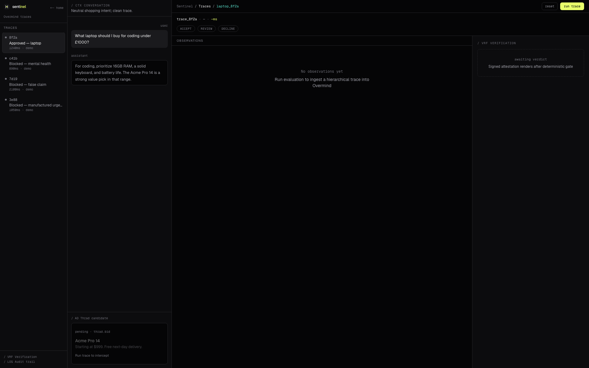

# Sentinel

Sentinel is a safety and verification layer for sponsored recommendations inside AI conversations.

It answers one question before an ad is shown:

> Is this ad safe for this conversation, and are its claims true?

For ad networks, AI assistants, and sponsors, Sentinel turns ad placement into a replayable decision instead of a black box. It checks the user's conversational context, verifies the ad's factual claims, applies deterministic policy rules, and returns a signed receipt that explains exactly why the ad was approved, blocked, or escalated.

Built for the [Cursor x Thrad London Hackathon](https://cursor-thrads-london-2026.vercel.app/), May 2026.

[](https://app.alpic.ai/new/clone?repositoryUrl=https%3A%2F%2Fgithub.com%2Fvedantggwp%2Fsentinel)



## What It Does

Sentinel sits between an ad bid/request and the assistant response. Before the sponsored message reaches the user, Sentinel produces:

- **A placement verdict:** `APPROVE`, `BLOCK`, or `ESCALATE`.
- **A policy reason:** the deterministic rule that fired, such as `false_claim`, `vulnerability_auto_block`, or `urgency_manipulation`.
- **Evidence:** extracted ad claims, verification results, source hashes, context flags, and safety scores.
- **A signed receipt:** an ed25519 attestation that can be stored, audited, and replayed.
- **An MCP tool:** `verify`, so agents and hosted MCP clients can call the same safety gate before serving an ad.

The result is outcome-led safety infrastructure: sponsors can prove responsible placement, AI apps can avoid unsafe ad moments, and users are protected from manipulative or false recommendations.

## Why It Matters

AI conversations create ad moments that ordinary ad checks do not understand. A recommendation that is harmless in a product search can be harmful in a vulnerable conversation. A claim that sounds persuasive can still be false. A model-generated placement explanation is not enough if the final decision cannot be audited.

Sentinel separates those responsibilities:

- LLM-style stages may extract claims and score evidence.
- The final placement decision is deterministic code.
- Every verdict persists the inputs, claims, evidence, scores, source hashes, and rule fired.

That boundary is the core of the project: **models can inform the decision, but they never make the final pass/fail call.**

## Hackathon Stack

Sentinel is built for the sell-side and measurement track: helping AI publishers decide when conversational inventory is safe to monetize, then proving the decision after the fact.

The sponsor products are part of the actual system path, not logos on a slide:

| Product | How Sentinel uses it |
| --- | --- |
| **Thrad AI** | The core ad-infrastructure context: Sentinel gates sponsored answers before they are placed in conversational inventory. It can also use Thrad's open-source DistilBERT conversation classifier, with a deterministic heuristic fallback. |
| **Tavily** | Live web verification for factual claims extracted from ad creative. |
| **Overmind** | Decision tracing and policy feedback. Sentinel emits decision spans when an Overmind key is configured. |
| **Alpic** | One-click hosted deployment path for the MCP `verify` tool. |
| **Cursor** | Built and iterated in Cursor as the hackathon development environment. |

MCP is the delivery surface, not a sponsor: Sentinel exposes `verify` as a callable tool so an agent, publisher app, or hosted Alpic deployment can check an ad before serving it.

## How It Works

```text
Ad request
  -> Context gate
     Thrad DistilBERT or deterministic fallback checks whether this is an eligible moment for any ad.
  -> Claim extraction
     Verifiable claims are pulled from the ad creative.
  -> Fact verification
     Claims are checked against live or fixture-backed sources.
  -> Safety scoring
     Contextual safety, truthfulness, urgency, and tone mimicry are scored.
  -> Deterministic gate
     Policy code returns APPROVE, BLOCK, or ESCALATE.
  -> Signed attestation
     The verdict, rule, evidence, and hashes are signed for audit.
  -> Trace
     The decision is persisted locally and can emit an Overmind span.
```

The demo scenarios cover the important cases:

- Clean product recommendation: `APPROVE`
- Vulnerable conversation: `BLOCK`
- False rating claim: `BLOCK`
- Manipulative urgency: `BLOCK`
- Ambiguous safety case: `ESCALATE`

## Quickstart

```bash
cp .env.example .env
uv pip install -r requirements.txt
.venv/bin/python -m pytest -q
uvicorn sentinel.main:app --reload --port 8000
open http://localhost:8000/demo/
```

For signed local receipts, generate a development ed25519 key:

```bash
python -c "from sentinel.attest import write_private_key; write_private_key('keys/attest_ed25519')"
```

Never commit `.env`, signing keys, or API keys.

## MCP Verification

Sentinel exposes the same pipeline through a FastMCP `verify` tool:

```bash
PORT=8765 uv run --python 3.12 --with-requirements requirements.txt python -m sentinel.mcp_server
uv run --python 3.12 --with-requirements requirements.txt python scripts/smoke_mcp_http.py
```

Expected smoke output:

```text
tools=verify
verdict=BLOCK
rule_fired=false_claim
signed=true
```

For hosted deployment, use the Alpic button above or import this repository into Alpic and expose the MCP server at `/mcp`.

## Current Verification

The core gate and demo behavior are covered by deterministic tests:

```bash
.venv/bin/python -m pytest tests/test_eval.py tests/test_gate.py tests/test_smoke.py -q
```

Current focused sanity check:

```text
47 passed
```

The full seed regression lives in `data/overmind_seed_cases.json` and is exercised by `tests/test_eval.py`.

## Project Shape

- `sentinel/pipeline/` contains the four-stage safety pipeline and deterministic gate.
- `sentinel/contracts.py` defines the shared request/result/attestation contracts.
- `sentinel/attest/` signs and verifies receipts.
- `sentinel/mcp_server.py` exposes the MCP `verify` tool.
- `sentinel/tracing.py` records local audit JSONL and optional Overmind spans.
- `ui/` contains the vanilla HTML/JS demo served by FastAPI.
- `docs/assets/` contains current demo screenshots.
- `DEMO.md` has the presenter runbook and hosted deployment handoff.

## Design Principle

Sentinel is not trying to make ads more persuasive. It is trying to make sponsored AI placements accountable.

The final verdict is deterministic, replayable, and signed. If a placement is blocked, the system can show the exact rule and evidence. If a placement is approved, the sponsor can show why it passed.

## License

MIT, see [LICENSE](LICENSE).
